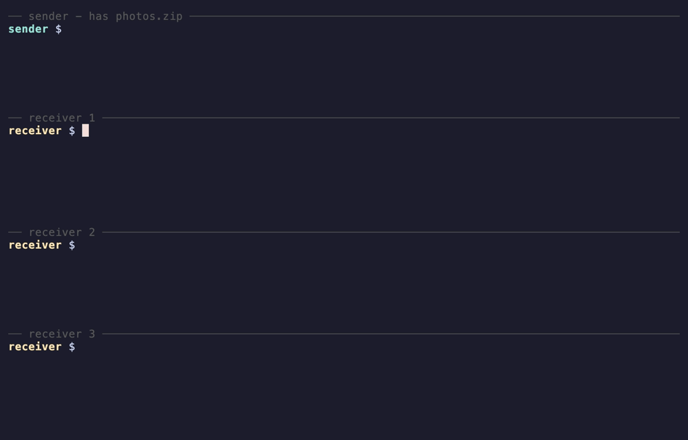

<div align="center">

# Filecast

**Send a file to every machine on your LAN at once.**
One sender, any number of receivers, no internet required.

<p>
    <a href="https://github.com/gistrec/filecast/actions/workflows/tests.yml">
        </a>
    <a href="https://app.codacy.com/gh/gistrec/filecast/dashboard">
        </a>
    <a href="https://github.com/gistrec/filecast/releases">
        </a>
    
    <a href="https://github.com/gistrec/filecast/blob/master/LICENSE">
        </a>
</p>



<sub>One transfer, three receivers. Recorded on a single machine over the
loopback interface (hence <code>--multicast</code>/<code>--iface</code>; on a
real LAN receivers just run <code>filecast receive</code>) —
<a href="docs/demo.tape">demo.tape</a>.</sub>

</div>

## Why filecast

- **One-to-many in a single transfer** — UDP broadcast or IP multicast; the
  network carries each byte once, so 40 machines take about the same time as
  one on a wired LAN
- **Fully offline** — no relay, no rendezvous server, no account; nothing
  leaves your network
- **Single small binary** for Windows, Linux, and macOS — receivers need zero
  setup: run `filecast receive`, done
- **Loss-tolerant** — receivers request dropped packets, and one
  retransmission repairs every receiver that missed the part
- **SHA-256 verified** — a corrupted file is rejected, not saved; an existing
  file is never overwritten unless you pass `--overwrite`
- **Resumable** — an interrupted receive picks up where it left off with
  `--resume`
- **Live progress** — speed, ETA, and a tunable target rate in Mbit/s
  (`--rate`)
- **No encryption yet** — filecast assumes a trusted LAN; see
  [Limitations](#limitations)

## Quick Start

**Sender** (host that has the file):

```sh
filecast send photo.jpg
```

**Receiver** (one or more hosts on the same LAN):

```sh
filecast receive
```

The file is saved under the name the sender announced (pass a path to override
it, e.g. `filecast receive my-photo.jpg`).

Send to a specific host instead of broadcasting to the whole LAN:

```sh
filecast send photo.jpg --to 192.168.1.50
```

## Installation

**Homebrew** (macOS, Linux):

```sh
brew install gistrec/filecast/filecast
```

**One-liner** (Linux, macOS):

```sh
curl -fsSL https://raw.githubusercontent.com/gistrec/filecast/master/install.sh | sh
```

The script picks the prebuilt binary for your platform from the latest
[GitHub Release](https://github.com/gistrec/filecast/releases), verifies its
SHA-256 against the release's `checksums.txt`, and installs it to
`/usr/local/bin`. On Git Bash for Windows (no sudo), point it at a directory
you own:

```sh
curl -fsSL https://raw.githubusercontent.com/gistrec/filecast/master/install.sh | BIN_DIR="$HOME/bin" sh
```

**Manual**: download a binary from the
[releases page](https://github.com/gistrec/filecast/releases) — Linux
x86_64/arm64, macOS (universal), Windows x86_64 — and run it directly. No
installation required.

If your platform isn't covered, see
[Building from Source](#building-from-source).

## Use Cases

- **Air-gapped and offline networks** — distribute files with no cloud, no
  server, and no per-machine configuration
- **Classrooms and training labs** — push exercise files to every student
  machine in one go
- **Fleet provisioning** — drop an installer or a patch onto a rack of
  machines simultaneously
- **LAN parties** — everyone gets the mod in the time of one transfer

One file per run, up to 4 GiB with the current wire format — transfers are
stored on disk as they arrive, not buffered wholly in RAM (see
[Limitations](#limitations)).

## How It Compares

As far as we know, filecast is the only file-transfer tool that combines
**all** of the following:

- sends one file to **many machines in a single transfer** (UDP
  broadcast/multicast),
- **cross-platform** prebuilt binaries — Windows, macOS, and Linux,
- works **fully offline** — no relay or rendezvous server,
- **zero receiver setup** — no daemon, no keys, no config file,
- **resumes** an interrupted receive,
- verifies every file **end-to-end with SHA-256**.

udpcast, UFTP, croc, LocalSend, and magic-wormhole each cover part of that
list — see the sourced feature table in [docs/COMPARISON.md](docs/COMPARISON.md),
including what they do better (encryption, internet transfer, mobile apps).

## Usage

```sh
filecast send <file> [options]       # broadcast a file to the LAN
filecast receive [file] [options]    # receive a file (default: name from sender)
```

## Parameters

| Parameter | Default | Range | Description |
| --------- | ------- | ----- | ----------- |
| `<file>` (positional) | — (send) / name from sender (receive) | — | File to send, or where to save it. `-f, --file` is an alias |
| `--to`        | broadcast  | IPv4 | Send to one host instead of LAN broadcast |
| `--multicast` | broadcast  | IPv4 multicast | Use an IP multicast group (224.0.0.0-239.255.255.255) instead of broadcast |
| `--iface`     | system-chosen | IPv4 | Multicast interface — the local NIC's IPv4 to send/receive the group on (`--multicast` only) |
| `-p, --port`  | `33333`    | 1..65535 | Destination port for outgoing packets |
| `--bind-port` | `33333`    | 1..65535 | Local port to bind on |
| `--mtu`       | `1500`     | 64..65489 | Max packet size in bytes (18-byte header keeps the datagram within the 65507-byte UDP limit) |
| `--ttl`       | `15`       | > 0 | Seconds of silence before giving up |
| `--rate`      | `100`      | > 0 | Target send rate in Mbit/s |
| `--overwrite` | off        | — | Overwrite an existing output file |
| `--resume`    | off        | — | Resume an interrupted receive from its `.part` snapshot |
| `-v, --verbose` | off      | — | Log every packet instead of a progress bar |
| `--delay-ms`  | —          | ≥ 0 | Advanced: fixed inter-packet pause in ms; overrides `--rate` (`0` blasts at full speed, used by tests) |
| `-h, --help`  | —          | — | Print help |
| `--version`   | —          | — | Print version |

## Examples

**LAN broadcast** (one sender, many receivers):

```sh
# On the sender host
filecast send album.zip

# On every receiver host
filecast receive album.zip
```

**Targeted unicast** (when broadcast is blocked or you only have one receiver):

```sh
# On the sender host (sends data to 10.0.0.42)
filecast send album.zip --to 10.0.0.42

# On 10.0.0.42 (receiver broadcasts its RESENDs by default)
filecast receive album.zip
```

**IP multicast** (one-to-many without flooding every host on the VLAN — NICs of
non-members drop the traffic in hardware and IGMP-snooping switches forward it
only to subscribers). Sender and every receiver use the same group:

```sh
# On the sender host
filecast send album.zip --multicast 239.1.2.3

# On every receiver host (same group)
filecast receive album.zip --multicast 239.1.2.3
```

On a multi-homed host (several NICs), pin the group to a specific interface by
its local IPv4 so the kernel doesn't pick the wrong one:

```sh
filecast send album.zip --multicast 239.1.2.3 --iface 192.168.1.10
filecast receive album.zip --multicast 239.1.2.3 --iface 192.168.1.10
```

**Loopback test** (sender and receiver on the same host — useful for
development):

```sh
# Receiver listens on 33401, sends RESEND back to the sender's bind port (33402)
filecast receive out.bin \
         --to 127.0.0.1 --port 33402 --bind-port 33401 &

# Sender listens on 33402, sends data to the receiver's bind port (33401)
filecast send in.bin \
         --to 127.0.0.1 --port 33401 --bind-port 33402
```

## How It Works

The sender announces the file — size, SHA-256, name, and a random session id —
then broadcasts it in MTU-sized chunks. Once the sender signals `FINISH`, each
receiver requests the chunks it missed, and every retransmission repairs all
receivers that missed that part at once. The file is written out (atomically)
only after its SHA-256 matches the announcement.

The full wire format lives in [docs/PROTOCOL.md](docs/PROTOCOL.md).

## Resuming an Interrupted Transfer

If a receive is interrupted with Ctrl+C, or times out with parts still missing,
the receiver saves what it has to `<name>.part` (plus a `<name>.part.idx` record
of which parts arrived). Re-run with `--resume` and it picks up where it left
off — the transfer is matched by the file's SHA-256, so it works even if the
sender is restarted (a new session):

```sh
filecast receive album.zip --resume
```

The snapshot is deleted once the file completes and its checksum verifies.

## Limitations

- The v3 wire format stores the file size and part index in 4-byte fields. The
  receiver enforces a 4 GiB cap on the announced file size; the sender rejects
  files that do not fit the current wire-size field.
- The sender streams payload from the source path after announcing its SHA-256.
  Do not modify, truncate, replace, or delete the source file until the transfer
  has finished, including any resend phase; otherwise receivers will reject the
  result with a checksum mismatch or the sender will abort on a read error.
- Receivers need enough free disk space for the in-progress `.part` file beside
  the final output. With `--resume`, the `.part` file and its `.part.idx` bitmap
  are kept after Ctrl+C or a timeout so a later run can continue. A hard kill
  (SIGKILL) or power loss mid-transfer can still lose the latest unflushed
  progress. The `.part`/`.part.idx` files use stable, predictable names in the
  working directory, so run the receiver from a directory only you can write to.
- No authentication. Any host on the same LAN can announce a transfer and any
  receiver bound to the chosen port will accept it. The SHA-256 check catches
  accidental corruption, not a deliberately crafted stream.
- No encryption yet. The payload travels as plaintext UDP; treat the LAN as
  trusted.
- Designed for wired LANs. Wi-Fi access points transmit broadcast/multicast
  frames at a low basic rate without link-layer ACKs, so expect heavy loss
  over wireless. The sender's rate limit is open-loop (no congestion
  feedback) — pick `--rate` with your network in mind.

## Building from Source

### Requirements

- CMake 3.15+
- A C++17 compiler:
  - GCC 7+ or Clang 5+ on Linux/macOS,
  - MinGW64 GCC via [MSYS2](https://www.msys2.org/) on Windows,
  - or MSVC 2019+ through the Visual Studio CMake generator.
- pthreads (Linux/macOS).

### Build

```sh
git clone https://github.com/gistrec/filecast.git
cd filecast
git submodule update --init --recursive
cmake -S . -B build
cmake --build build --config Release
```

The binary lands at `build/filecast` (or `build\Release\filecast.exe` with the
multi-config Visual Studio generator).

### Tests

```sh
ctest --test-dir build --output-on-failure
```

Runs the unit tests, the loopback end-to-end test, and a lossy variant that
drops packets through a Python UDP proxy to exercise the RESEND branch. Pass
`-E e2e` to skip the e2e cases on Windows, where Winsock semantics break
two-process loopback.

## License

[MIT](LICENSE).
